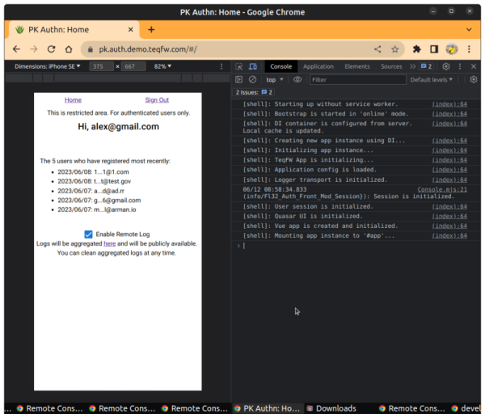
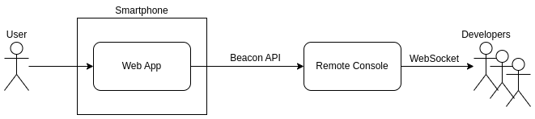
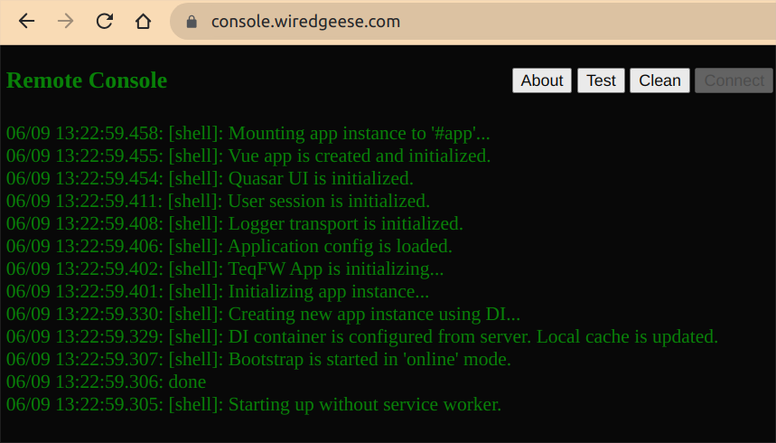
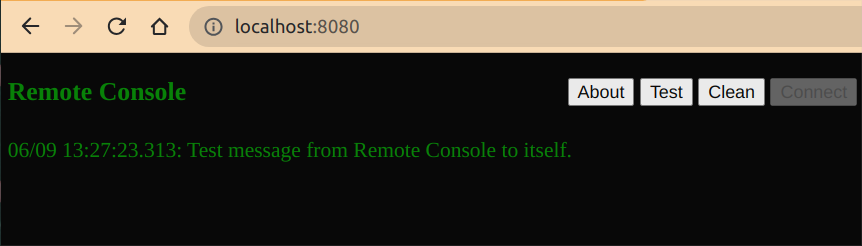
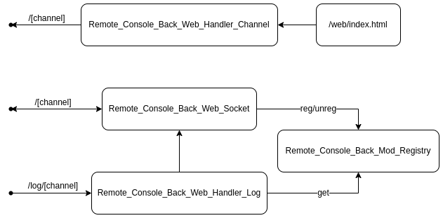

# Remote Console for Web Apps

This is a developer tool designed to address the issue of being unable to view `console.log()` output in mobile
applications. Mobile browsers lack the Developer Tools panel, which makes debugging challenging:



With this app, you have the option to launch it as a standalone server on your local computer for enhanced security.
Alternatively, you can use our public server at `https://console.wiredgeese.com/`, where all developers can share their
logs, separated by channels (you need to know the name of the channel to see logs from this
channel - https://console.wiredgeese.com/any-random-string/).

## Overview

The Remote Console collects log items sent through
the [Beacon API](https://developer.mozilla.org/en-US/docs/Web/API/Beacon_API) and retransmits them to all connected
developers via WebSockets:



All logs are separated by channels. If you send your logs to `https://console.wiredgeese.com/log/any-random-string`,
then these logs will only be available on the `https://console.wiredgeese.com/any-random-string` page.

To collect console logs, you need to modify the original `console.log()` function in your web app. Add the following
code before any console output, preferably in the `HEAD` section of the main HTML page:

```javascript
const orig = console.log;
console.log = function () {
    orig.apply(console, arguments);
    navigator.sendBeacon('https://console.wiredgeese.com/log/[channel]', arguments[0]);
};
```

To test the remote console, go to https://console.wiredgeese.com/test-channel, then send logs to the same channel:

```shell
$ wget --header "Content-Type: text/plain" --post-data 'Hello from wget!' https://console.wiredgeese.com/log/test-channel
```

If you launch the Remote Console app on your computer, you need to send logs to `http(s)://ip.or.domain:port/log/`.
The Developers WebUI is available at `http(s)://ip.or.domain:port/` (you don't need a channels in this case):



## Usage as a standalone server

```shell
$ git clone https://github.com/flancer64/spa-remote-console.git
$ cd spa-remote-console/
$ npm install
$ npm start
```

Go to http://localhost:8080/ and press the `Test` button to validate availability:



Expose port `8080` to make it available externally, and then send text logs using the Beacon API:

```javascript
navigator.sendBeacon('http://xxx.xxx.xxx.xxx:8080/log/', 'any log message');
```

If you are working in a group, all developers will be able to see the same logs through the WebUI.

### Log Modes

There are two spaces for collecting logs:

* `http://xxx.xxx.xxx.xxx:8080/log/[channel]`: Any text message without a timestamp. The server adds the timestamp.
* `http://xxx.xxx.xxx.xxx:8080/timed/[channel]`: The log record should start with a timestamp 'mm/dd hh:mm:ss.mmm' to be
  ordered on the front end.

## Web UI

* `About`: Link to this repository.
* `Test`: Send a test message to the current channel to test connectivity.
* `Clean`: Clean all logs on the page.
* `Connect`: Reconnect to the backend if the connection was lost.

The WebUI display contains the last 64 log items (refer to `MAX_ITEMS` in the `./web/index.html` code).

## Main Components



* Frontend:
    * `./web/index.html`: Displays logs for developers.

* Backend:
    * `Remote_Console_Back_Web_Handler_Log`: Web request handler to receive log messages from external sources on any
      address like `./log/[channel]`.
    * `Remote_Console_Back_Web_Handler_Channel`: Web request handler to send `./web/index.html` on any request
      like `/channel`, to open a separated log messages channel for developers.
    * `Remote_Console_Back_Web_Socket`: WebSocket handler to open 2-way connections with developers.
    * `Remote_Console_Back_Mod_Registry`: Registry for opened WebSocket connections separated by channels.
